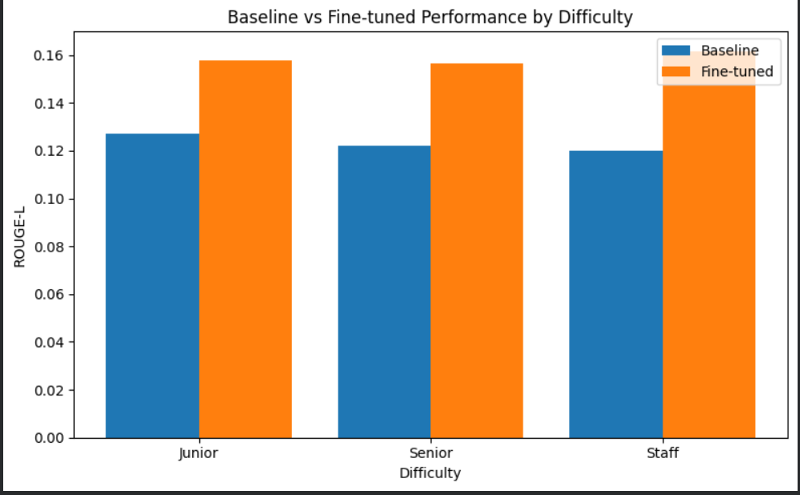
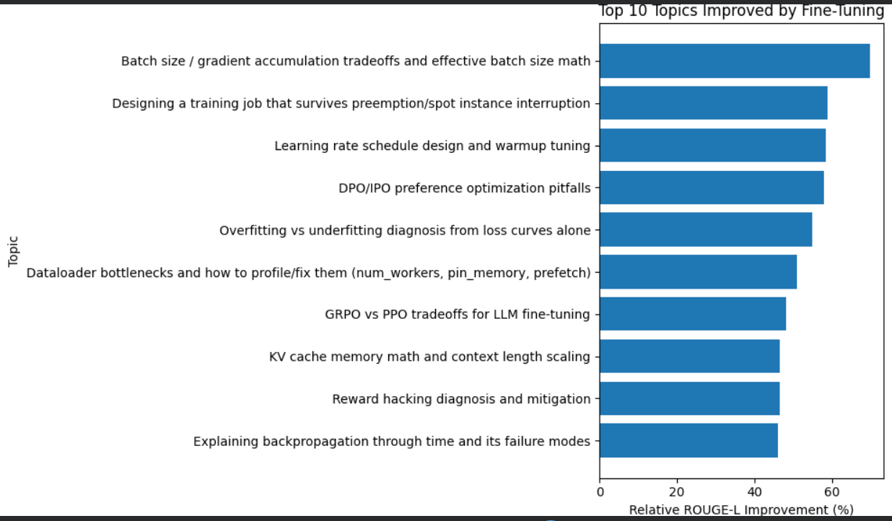

# Qwen2.5-1.5B QLoRA Fine-Tuning & Evaluation

A practical experiment on fine-tuning **Qwen2.5-1.5B** using **QLoRA** and evaluating whether the fine-tuned model actually performs better than the original base model on a custom instruction dataset.

The project focuses not only on fine-tuning, but also on **quantitative evaluation, comparison, topic-level analysis, difficulty-level analysis, and regression analysis**.

---

## 🎯 Objective

The main objective of this project was to investigate:

> **Does parameter-efficient fine-tuning improve the performance of a small language model on a task-specific dataset?**

Instead of evaluating only the fine-tuned model, the project compares it against the **original base model** using the same evaluation examples.

---

## 🧠 Model & Fine-Tuning

**Base Model:** Qwen2.5-1.5B

**Fine-Tuning Method:** QLoRA

QLoRA enables parameter-efficient fine-tuning by keeping the base model quantized while training lightweight adapter parameters.

### Technologies Used

- Python
- PyTorch
- Hugging Face Transformers
- Hugging Face Datasets
- PEFT
- QLoRA
- BitsAndBytes
- TRL
- ROUGE-L
- Google Colab

---

## 🔄 Project Workflow

```text
Custom Dataset
      ↓
Data Preparation
      ↓
Train / Validation / Test Split
      ↓
Base Qwen2.5-1.5B
      ↓
QLoRA Fine-Tuning
      ↓
Fine-Tuned Model
      ↓
Generate Predictions
      ↓
Evaluate Base Model
      ↓
Evaluate Fine-Tuned Model
      ↓
Compare Performance
      ↓
Topic & Difficulty Analysis
      ↓
Regression Analysis


📊 Evaluation Method

The base model and fine-tuned model were evaluated on the same evaluation examples.

The comparison includes:

Baseline predictions
Fine-tuned predictions
ROUGE-L scores
Per-example improvement
Topic-wise performance
Difficulty-wise performance
Regression analysis

The purpose of the evaluation was to determine whether fine-tuning produced measurable improvement rather than assuming that fine-tuning automatically improves performance.


📈 Results
Performance by Difficulty

The following visualization compares the performance of the baseline model and fine-tuned model across different difficulty levels.

This provides a direct view of how fine-tuning affected model performance across different levels of task difficulty.


Top 10 Topics Improved by Fine-Tuning

The following visualization shows the topics with the largest improvement after fine-tuning.

This helps identify the areas where the fine-tuned model benefited most from the training data.


🔍 Error & Regression Analysis

Fine-tuning does not necessarily improve every individual example.

Therefore, examples where the fine-tuned model performed worse than the baseline were separately identified and analyzed.

This provides a more realistic evaluation of the fine-tuning process and helps identify cases where fine-tuning introduced regressions.

Detailed evaluation and comparison files are available in the results/ directory.


📁 Repository Structure

LLM-FineTuning-Project/
│
├── data/
│   ├── train/
│   │   └── train.csv
│   ├── validation/
│   │   └── validation.csv
│   └── test/
│       └── test.csv
│
├── notebook/
│   └── fine_tuning.ipynb
│
├── results/
│   ├── plots/
│   │   ├── performance_by_difficulty.png
│   │   └── top_10_topics_improvement.png
│   │
│   ├── baseline_predictions.csv
│   ├── baseline_vs_finetuned.csv
│   ├── difficulty_analysis.csv
│   ├── finetuned_metrics.csv
│   ├── finetuned_predictions.csv
│   ├── per_example_error_analysis.csv
│   ├── qualitative_eval_set.csv
│   └── topic_analysis.csv
│
├── models/
│   └── README.md
│
└── README.md


📓 Notebook

The complete experimental workflow is available in:

notebook/fine_tuning.ipynb

The notebook contains:

Dataset preparation
Data splitting
Model setup
QLoRA configuration
Fine-tuning
Baseline evaluation
Fine-tuned model evaluation
Quantitative comparison
Topic analysis
Difficulty analysis
Regression analysis


📂 Results

The results/ directory contains the generated evaluation outputs used for comparing the base and fine-tuned models.

These include:

Model predictions
Comparison metrics
Topic-level analysis
Difficulty-level analysis
Error analysis
Qualitative evaluation examples


## 📊 Graphs

### 1. Baseline vs Fine-Tuned Performance by Difficulty



### 2. Top 10 Topics Improved by Fine-Tuning




⚠️ Model Weights

The trained model weights are not included in this repository because of their large size.

The notebook contains the workflow used to fine-tune the model.


🚀 Reproducibility

The experiment was developed and executed using Google Colab.

To reproduce the workflow:

Open the notebook in notebook/.
Install the required dependencies.
Prepare the dataset.
Load the Qwen2.5-1.5B base model.
Configure QLoRA.
Run the fine-tuning process.
Generate baseline and fine-tuned predictions.
Run the evaluation and analysis sections.


👩‍💻 Author

Heena Gautam


## Step 3 — Where the graphs appear

This is the important part.

Your GitHub README will visually look like:

```text
PROJECT TITLE
       ↓
OBJECTIVE
       ↓
MODEL & TECHNOLOGY
       ↓
PROJECT WORKFLOW
       ↓
EVALUATION METHOD
       ↓
━━━━━━━━━━━━━━━━━━━━
       RESULTS
━━━━━━━━━━━━━━━━━━━━

Performance by Difficulty

       [YOUR GRAPH 1]
       
Top 10 Topics Improved

       [YOUR GRAPH 2]

       ↓
ERROR & REGRESSION ANALYSIS
       ↓
REPOSITORY STRUCTURE
       ↓
NOTEBOOK
       ↓
REPRODUCIBILITY
       ↓
AUTHOR
