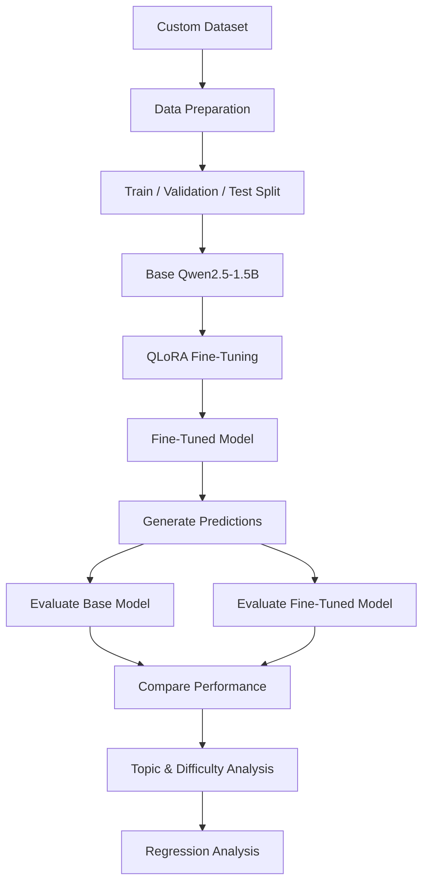

[README (4).md](https://github.com/user-attachments/files/31104424/README.4.md)
# 🚀 Qwen2.5-1.5B QLoRA Fine-Tuning & Evaluation

<p align="center">
  
  
  
  
  
</p>

<p align="center">
  A practical, end-to-end experiment fine-tuning <strong>Qwen2.5-1.5B</strong> with <strong>QLoRA</strong> — and rigorously testing whether it actually performs better than the base model, rather than assuming it does.
</p>

---

## 📑 Table of Contents

- [Objective](#-objective)
- [Model & Fine-Tuning](#-model--fine-tuning)
- [Project Workflow](#-project-workflow)
- [Evaluation Method](#-evaluation-method)
- [Results](#-results)
- [Error & Regression Analysis](#-error--regression-analysis)
- [Repository Structure](#-repository-structure)
- [Notebook](#-notebook)
- [Reproducibility](#-reproducibility)
- [Model Weights](#️-model-weights)
- [Author](#-author)

---

## 🎯 Objective

The central question driving this project:

> **Does parameter-efficient fine-tuning actually improve the performance of a small language model on a task-specific dataset — or is the improvement assumed rather than proven?**

Rather than evaluating the fine-tuned model in isolation, this project runs a **controlled, side-by-side comparison** against the original base model on identical evaluation examples, then digs into *where* and *why* performance changed using topic-level, difficulty-level, and regression analysis.

---

## 🧠 Model & Fine-Tuning

| | |
|---|---|
| **Base Model** | Qwen2.5-1.5B |
| **Fine-Tuning Method** | QLoRA (Quantized Low-Rank Adaptation) |
| **Evaluation Metric** | ROUGE-L |

QLoRA enables parameter-efficient fine-tuning by keeping the base model quantized (4-bit) while training lightweight, low-rank adapter layers on top — dramatically reducing memory and compute requirements without sacrificing the quality of task adaptation.

### 🛠️ Technologies Used

<p>
  
  
  
  
  
  
  
  
</p>

---

## 🔄 Project Workflow



---

## 📊 Evaluation Method

The base model and the fine-tuned model were evaluated on the **exact same held-out examples**, ensuring a fair, apples-to-apples comparison. The evaluation pipeline produces:

- ✅ Baseline predictions
- ✅ Fine-tuned predictions
- ✅ ROUGE-L scores per example
- ✅ Per-example improvement deltas
- ✅ Topic-wise performance breakdown
- ✅ Difficulty-wise performance breakdown
- ✅ Regression analysis (where fine-tuning *hurt* performance)

The goal was to **prove** measurable improvement with data — not simply assume that fine-tuning helps.

---

## 📈 Results

### 1️⃣ Baseline vs Fine-Tuned Performance by Difficulty

The chart below compares ROUGE-L scores between the baseline and fine-tuned model across three difficulty tiers — **Junior**, **Senior**, and **Staff** — offering a direct view of how fine-tuning affects performance as task complexity increases.


**Key takeaway:** the fine-tuned model outperforms the baseline consistently across *all* difficulty levels, with the largest relative gains appearing at the **Staff** level — suggesting fine-tuning helps most on the hardest, most nuanced examples.


## 2️⃣ Top 10 Topics Improved by Fine-Tuning

This chart ranks the topics with the **largest relative ROUGE-L improvement** after fine-tuning, highlighting exactly where the training data had the greatest impact.


**Key takeaway:** the strongest gains cluster around **ML systems and training-engineering topics** — batch size / gradient accumulation tradeoffs, fault-tolerant training design, learning-rate scheduling, and preference-optimization pitfalls (DPO/IPO) — indicating the fine-tuning dataset was especially effective at teaching deep, applied LLM-training knowledge.

---

## 🔍 Error & Regression Analysis

Fine-tuning does not uniformly improve every example — and pretending otherwise would make for a dishonest evaluation. To keep this analysis grounded in reality, examples where the **fine-tuned model underperformed the baseline** were specifically isolated and studied.

This regression analysis:
- Surfaces cases where fine-tuning introduced *new* errors
- Helps distinguish genuine skill improvement from overfitting to certain patterns
- Provides a more realistic, trustworthy picture of what the fine-tuning process actually achieved

📁 Full evaluation and comparison files are available in the [`results/`](results/) directory.

---

## 📁 Repository Structure

```text
LLM-FineTuning-Project/
│
├── data/
│   ├── train/
│   │   └── train.csv
│   ├── validation/
│   │   └── validation.csv
│   └── test/
│       └── test.csv
│
├── notebook/
│   └── fine_tuning.ipynb
│
├── results/
│   ├── plots/
│   │   ├── performance_by_difficulty.png
│   │   └── top_10_topics_improvement.png
│   │
│   ├── baseline_predictions.csv
│   ├── baseline_vs_finetuned.csv
│   ├── difficulty_analysis.csv
│   ├── finetuned_metrics.csv
│   ├── finetuned_predictions.csv
│   ├── per_example_error_analysis.csv
│   ├── qualitative_eval_set.csv
│   └── topic_analysis.csv
│
├── models/
│   └── README.md
│
└── README.md
```

---

## 📓 Notebook

The complete experimental workflow lives in:

📔 [`notebook/fine_tuning.ipynb`](notebook/fine_tuning.ipynb)

It walks through:

1. Dataset preparation
2. Data splitting (train / validation / test)
3. Model setup
4. QLoRA configuration
5. Fine-tuning
6. Baseline evaluation
7. Fine-tuned model evaluation
8. Quantitative comparison
9. Topic analysis
10. Difficulty analysis
11. Regression analysis

---

## 📂 Results Directory

The [`results/`](results/) directory contains every generated evaluation output used to compare the base and fine-tuned models:

- Model predictions (baseline & fine-tuned)
- Comparison metrics
- Topic-level analysis
- Difficulty-level analysis
- Error / regression analysis
- Qualitative evaluation examples

---

## 🚀 Reproducibility

This experiment was developed and executed on **Google Colab**. To reproduce it:

1. Open the notebook in [`notebook/`](notebook/).
2. Install the required dependencies.
3. Prepare the dataset.
4. Load the Qwen2.5-1.5B base model.
5. Configure QLoRA.
6. Run the fine-tuning process.
7. Generate baseline and fine-tuned predictions.
8. Run the evaluation and analysis sections.

---

## ⚠️ Model Weights

The trained model weights are **not included** in this repository due to their large size. The notebook contains the complete workflow needed to reproduce fine-tuning from scratch.

---

## 👩‍💻 Author

**Heena Gautam**

---

<p align="center">
  <sub>If you found this project useful, consider ⭐ starring the repository!</sub>
</p>
